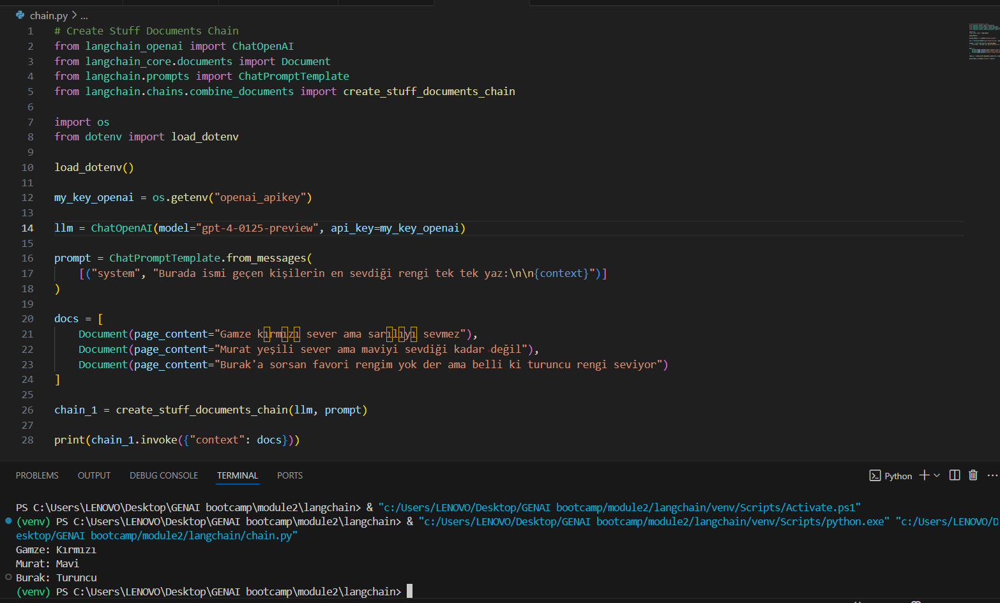
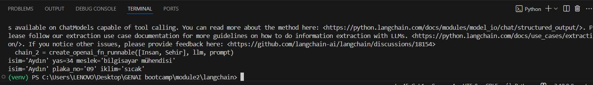

# LangChain-Text-Processing-and-Extraction-Demo
This project demonstrates two powerful LangChain techniques using OpenAI's language models:  
* Create Stuff Documents Chain: Processing and extracting information from multiple documents 
* Create OpenAI Function Runnable Chain: Converting natural language into structured data using function calling

# Features

* Uses LangChain with OpenAI's GPT-4 model
* Implements two different chain types for different use cases
* Demonstrates document processing and structured data extraction
* Environment variable management for API keys

# Requirements

* Python 3.8+
* LangChain
* OpenAI API key
* Pydantic
* python-dotenv

## Create a .env file in the root directory and add your OpenAI API key:
```python
openai_apikey=your_openai_api_key_here
````

## Run the script with Python:

```bash
python chain.py
```

# TR 
# Genel Bakış
Bu proje, OpenAI'nin dil modellerini kullanarak iki güçlü LangChain tekniğini göstermektedir:

* Create Stuff Documents Chain: Birden fazla belgeden bilgi işleme ve çıkarma
* Create OpenAI Function Runnable Chain: Fonksiyon çağırma kullanarak doğal dili yapılandırılmış verilere dönüştürme
  
# Özellikler

* LangChain ve OpenAI'nın GPT-4 modelini kullanır
* Farklı kullanım durumları için iki farklı zincir türünü uygular
* Belge işleme ve yapılandırılmış veri çıkarımını gösterir
* API anahtarları için ortam değişkeni yönetimi

# Gereksinimler

* Python 3.8+
* LangChain
* OpenAI API anahtarı
* Pydantic
* python-dotenv

## Kök dizinde bir .env dosyası oluşturun ve OpenAI API anahtarınızı ekleyin:

```python
openai_apikey=openai_api_anahtariniz_buraya
```
## Betik iki farklı LangChain tekniğini göstermektedir:

* 1. Create Stuff Documents Chain
     
   Bu teknik, insanların renk tercihleri hakkında bilgi içeren bir belge koleksiyonunu işler ve bu bilgileri çıkarır.


* 2. Create OpenAI Function Runnable Chain
     
  Bu teknik, metinden insanlar ve şehirler hakkında yapılandırılmış bilgi çıkarmak için OpenAI'nin fonksiyon çağırma yeteneklerini kullanır.


## Nasıl Çalışır?

### Create Stuff Documents Chain
* Betik, insanların renk tercihleri hakkında bilgi içeren bir belge koleksiyonu tanımlar.
* LangChain'in create_stuff_documents_chain fonksiyonunu kullanarak bu belgeleri işlemek için bir zincir oluşturur.
* Zincir, her kişinin favori rengi hakkında bilgileri çıkarır ve yapılandırılmış bir formatta sunar.
  
## Çıktı




### Create OpenAI Function Runnable Chain
* Betik, iki Pydantic modeli tanımlar: Insan ve Sehir.
* create_openai_fn_runnable aracılığıyla OpenAI'nin fonksiyon çağırma yeteneklerini kullanan bir zincir oluşturur.
* Doğal dil girdisi sağlandığında, model uygun şemayı belirler ve ilgili bilgileri çıkarır.

## Çıktı



